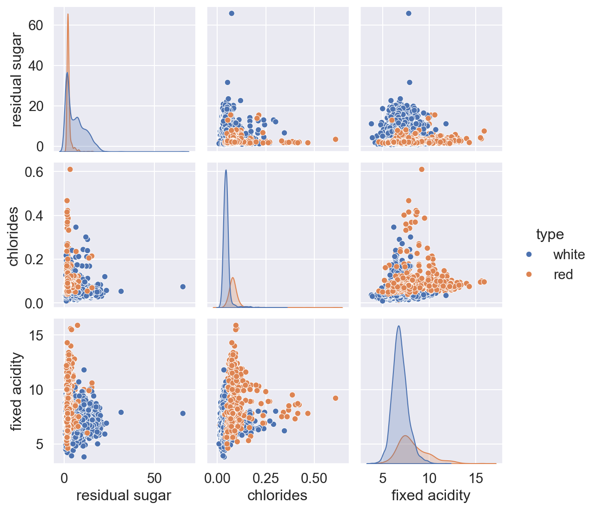
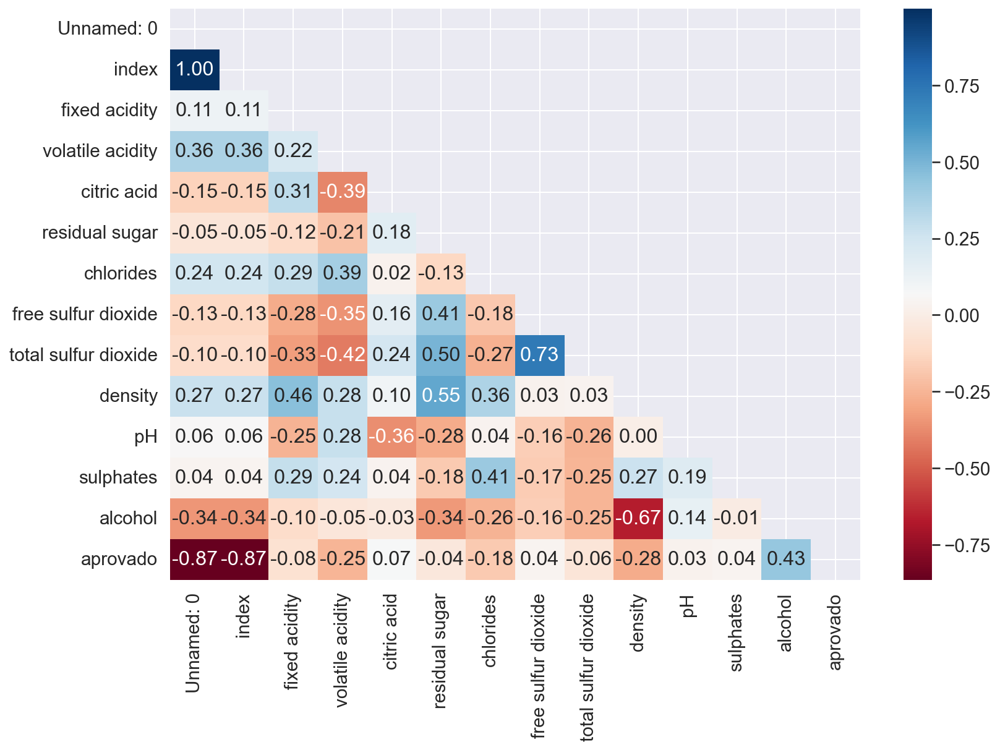
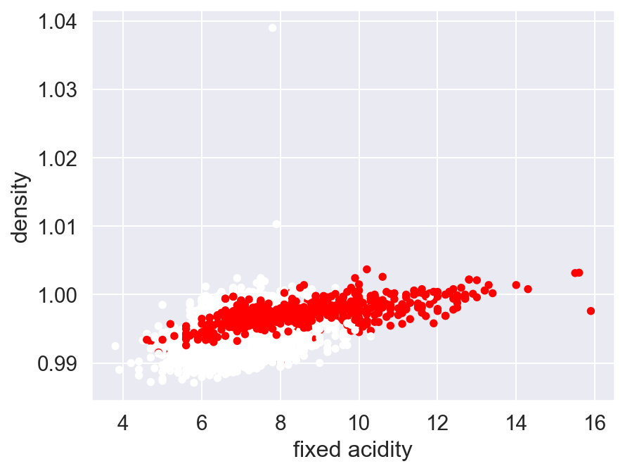

#  Wine Approval Analysis — Seleção de Features por Faixa

> Análise exploratória e seleção supervisionada de faixas de variáveis físico-químicas que maximizam a taxa de aprovação de vinhos.

---

##  Objetivo

Identificar, para cada variável físico-química de um vinho, **qual faixa de valores está associada à maior proporção de vinhos aprovados**, com controle mínimo de representatividade (n ≥ 100 amostras por faixa).

---

##  Estrutura do Projeto

```
 wine-approval-analysis
 ┣  Aula 7 - 2024/
 ┃ ┣  transf_wine_treino.csv
 ┃ ┗  transf_wine_teste.csv
 ┣  images/
 ┃ ┣  pairplot.png
 ┃ ┣  heatmap_correlacao.png
 ┃ ┗  scatter_acidity_density.png
 ┣  analise_vinhos.py
 ┣  graficos.py
 ┗  README.md
```

---

##  Análise Exploratória

### Relação entre variáveis por tipo de vinho

Pairplot comparando `residual sugar`, `chlorides` e `fixed acidity` separados por tipo (tinto/branco). Permite identificar padrões de separação entre os grupos.



---

### Matriz de correlação

Heatmap triangular com as correlações entre todas as variáveis numéricas. Guia a seleção de features evitando multicolinearidade.



---

### Acidez fixa vs Densidade por tipo de vinho

Scatter plot que evidencia a relação entre `fixed acidity` e `density`, colorido por tipo de vinho.



---

##  Como funciona o pipeline

O script `analise_vinhos.py` executa 6 passos para cada variável numérica:

| Passo | Descrição |
|-------|-----------|
| 1 | Divide a variável em faixas (`pd.cut`) |
| 2 | Agrupa por faixa e calcula contagem + média de aprovação |
| 3 | Filtra faixas com mínimo de amostras (`min_vinhos`) |
| 4 | Ordena por fração de aprovação (decrescente) |
| 5 | Seleciona a faixa com maior taxa de aprovação |
| 6 | Consolida resultado em DataFrame único |

A função `seleciona_faixa()` encapsula esse pipeline e é aplicada a **todas as colunas numéricas** automaticamente.

---

##  Parâmetros da função `seleciona_faixa`

```python
seleciona_faixa(dados, coluna, min_vinhos=100, faixas=10)
```

| Parâmetro | Tipo | Padrão | Descrição |
|-----------|------|--------|-----------|
| `dados` | DataFrame | — | Dataset de entrada |
| `coluna` | str | — | Coluna numérica a analisar |
| `min_vinhos` | int | 100 | Mínimo de amostras por faixa |
| `faixas` | int | 10 | Número de intervalos do `pd.cut` |

---

##  Exemplo de saída

```
coluna       faixa              contagem   fração vinhos aprovados
alcohol      (12.14, 12.83]        134              0.8731
chlorides    (0.022, 0.055]        412              0.7913
...
```

Aplicando o melhor filtro de `alcohol` nos dados de teste:

```
Média de vinhos aprovados com este filtro: 0.87
```

---

##  Instalação

```bash
git clone https://github.com/seu-usuario/wine-approval-analysis.git
cd wine-approval-analysis
pip install pandas numpy matplotlib seaborn missingno
```

---

##  Execução

```bash
# Análise de features
python analise_vinhos.py

# Gráficos exploratórios
python graficos.py
```

---

##  Dependências

```txt
pandas>=1.5
numpy>=1.23
matplotlib>=3.6
seaborn>=0.12
missingno>=0.5
```

---

##  Licença

MIT
